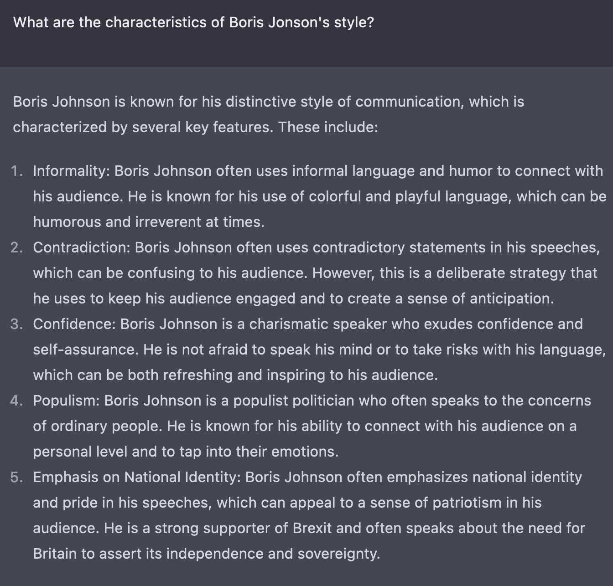
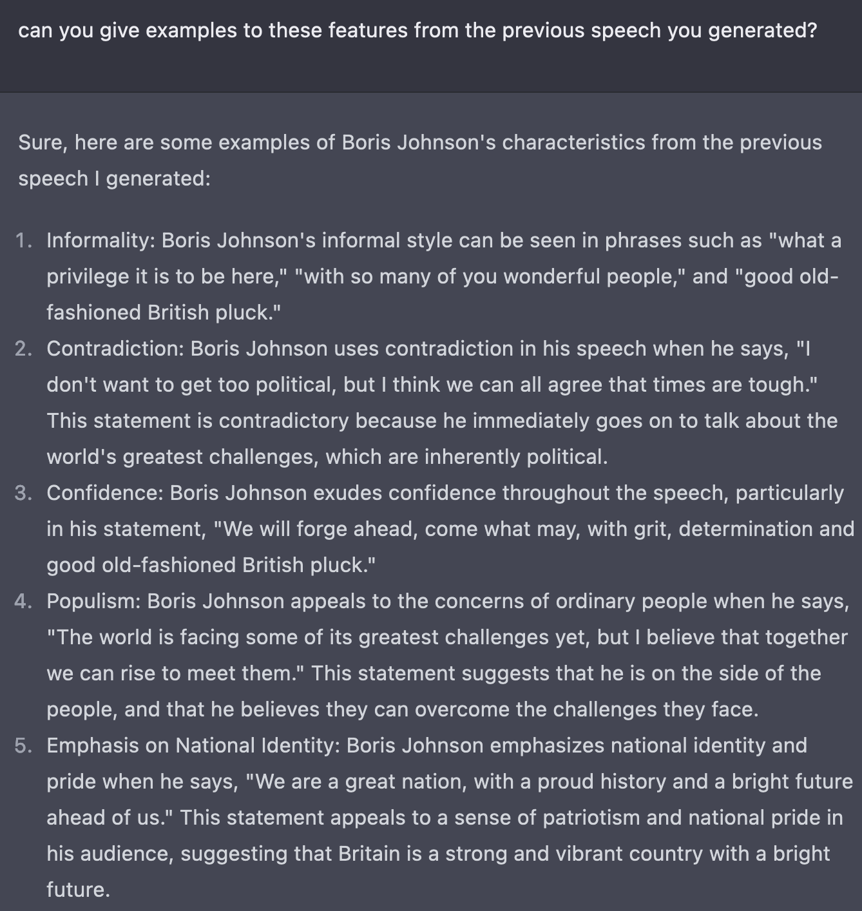

# AI Generation Tests
This repository is for collecting interesting generative model tests / applications (e.g. ChatGPT).

If you have good - either positive or negative - examples, I'd love to hear about them. 
Please don't hesitate to contribute to this repo by making a pull request!

# Can LLMs explain their own deicision making?

One of the most common criticism towards today's machine learning (especially [foundation](blog)) models is their "black box" nature. This refers to the difficuly of reverse engineering their decision making, which makes it difficult to test whether they caprure the patterns we intended them to do during traning.

This can result in all sort of unintended behaviours of the mode, which can trickle down to downstream applications and cause societal harm, which is often increasbly hard to notice.

For this reason I was interedted whether ChatGPT can give conrete reasons for why it generated content in a certain way.
This folder is to include such "behavioural" tests, such as the example below:

I think ChatGPT did a reasonable job on explaining _why_ it generated the speech this way. In my opinion, this type of questioning has great potential for providing more insight into a large model's decision making process.

If you have other - either positive or negative - examples, I'd love to hear about them. 
Please don't hesitate to contribute to this repo!